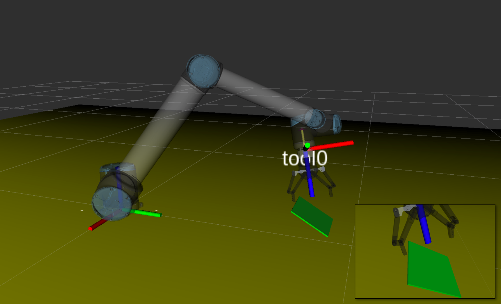
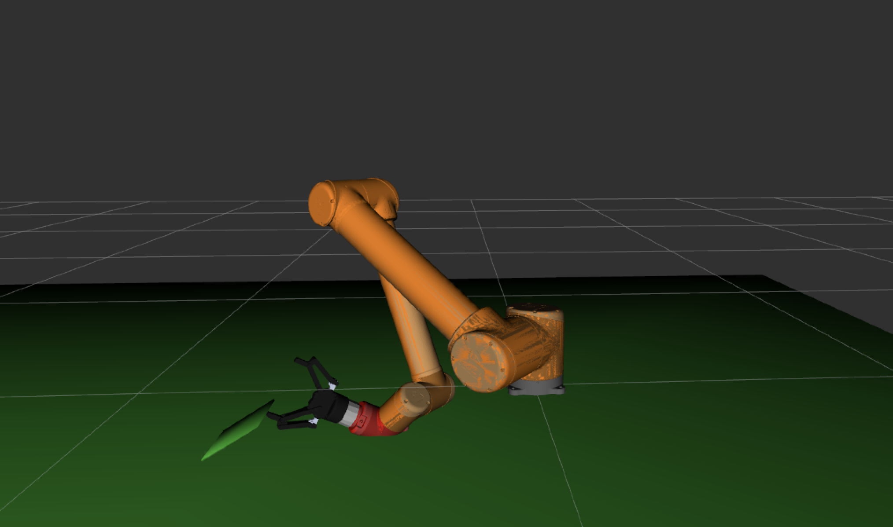

# Pickpack

## 1. Overview

This package presents a complete software pipeline for picking thin,rigid objects. This perception-to-manipulation system for picking is fully autonomous system, incorporating visual perception module for obejct detection and localization with force/torque sensing module for environment perception. The manipulation module is the core component of the system, which is an implementation of **Tilt-and-Pivot** manipulaiton technique: a novel robotic object handling technique for picking thin objects lying on a flat surface through  robotic dexterous, in-handmanipulation. Picking thin objects is an important manipulation capability with a wide range of pratical applications such as bin picking tasks, product packaging tasks.  

This ROS package is directly applicable to an ordinary robotic setting featuring the conventional two- or three-fingered grippers installed on UR10 robot arm. This system is demonstrated to be used for picking a range of objects: acrylic borad, plastic container lid, paper carton and can be applied on bin picking problem, in which individual objects are picked one by one out of clutter.

<p align = "center">
  
 
</p>

<!--**Video Link:** (https://www.youtube.com/watch?v=idWt6ZrfGDw)-->

**Authors**: Zhekai Tong (ztong@connect.ust.hk), Tierui He (theae@connect.ust.hk), Chung Hee Kim (chkimaa@connect.ust.hk), Yu Hin Ng (yhngad@connect.ust.hk), Qianyi Xu (qxuaj@connect.ust.hk), and [Jungwon Seo](http://junseo.people.ust.hk/)  


## 2. Prerequisites

### 2.1 Hardware
1. [**Universal Robot UR10**](https://www.universal-robots.com/products/ur10-robot/)
2. [**Robotiq 140mm Adaptive parallel-jaw gripper**](https://robotiq.com/products/2f85-140-adaptive-robot-gripper)
3. [**Robotiq FT300 Force/Torque Sensor**](https://robotiq.com/products/ft-300-force-torque-sensor) 
4. [**Realsense Camera SR300**](https://www.intelrealsense.com/coded-light/)

### 2.2 Software
Our software is developed in Ubuntu 16.04. ROS Kinetic
1. [**ROS Kinetic**](http://wiki.ros.org/kinetic/Installation/)
2. [**Driver for UR10 robot arms from universal robots**](https://github.com/ThomasTimm/ur_modern_driver/)
3. [**Universal Robot package for ROS Kinetic**](http://wiki.ros.org/universal_robot)
4. [**MoveIt!**](https://moveit.ros.org/)
5. [**Robotiq ROS package**](http://wiki.ros.org/robotiq/)
6. [**Mask R-CNN**](https://github.com/matterport/Mask_RCNN)
7. [**AprilTag ROS package**](https://github.com/AprilRobotics/apriltag_ros)

```.ipynb```
files can be run in [jupyter notebook](https://jupyter.readthedocs.io/en/latest/install.html).

## 3. Build on ROS
In your [catkin workspace](http://wiki.ros.org/catkin/Tutorials/create_a_workspace):
```
cd ~/catkin_ws/src
git clone https://github.com/HKUST-RML/pickpack.git
cd ..
catkin_make
```
## 4. Run Tilt-and-Pivot For Objects Picking

### 4.1 Run with real robot
1. Picking acrylic board script:
   
   Note: In multiple boards bin picking scenario, run ```~/catkin_ws/src/pickpack/Mask_RCNN/scripts/board_detection.ipynb``` first for instance detection and segmentation. Refer to Mask_RCNN/samples folder to train the vision perception module with your dataset.

   For single object picking scenario, run the following code:
   ```
   cd ~/catkin_ws/src/pickpack/scripts
   ```
   ```
   jupyter notebook 
   ```
   Open ```picking_acrylic_board.ipynb ```

   

2. Picking carton board script:
   ```
   cd ~/catkin_ws/src/pickpack/scripts
   ```
   ```
   jupyter notebook 
   ```
   Open ```picking_carton.ipynb ```

   Note: In multiple carton boards bin picking scenario, run ```~/catkin_ws/src/pickpack/Mask_RCNN/scripts/carton_detection.ipynb``` first for instance detection and segmentation.

3. Picking book script:
   ```
   cd ~/catkin_ws/src/pickpack/scripts
   ```
   ```
   jupyter notebook 
   ```
   Open ```picking_book.ipynb ```

4. Opening container lid script:
   ```
   cd ~/catkin_ws/src/pickpack/scripts
   ```
   ```
   jupyter notebook 
   ```
   Open ```opening_boxlid.ipynb ```

5. Picking acrylic board script with 3-finger gripper:
   ```
   cd ~/catkin_ws/src/pickpack/scripts
   ```
   ```
   jupyter notebook 
   ```
   Open ```picking_acrylic_board_with_3finger_gripper.ipynb ```


### 4.2 Run collision check with Moveit!

1. Start UR10 Robot-Gripper Scene

```
roslaunch tilt_pivot_collision_check demo.launch
```

2. Run collision check script

```
rosrun tilt_pivot_collision_check tilt_pivot_collision_check.py
```

If no collision is involved, the collision checker will visualize the path without any warning.

<p align = "center">
 
</p>

If a collision occurs, for example, there is collision between the joint of the robot and ground surface as shown in the figure below, the collision area will be denoted as red color.

<p align = "center">
 
</p>

### 4.3 Changing execution parameters
The parameters of the **Tilt-and-Pivot** process can be specified in every ```.ipynb``` file in scripts folder.

The parameters are as follows:

- **Robot Parameter**
    - ***global_speed***: Robot tool center point (TCP) speed
- **Object Dimension**
    - ***object_length***: object length in meters
- **Tilt-and-Pivot configuration**:
    - ***psi***: Angle between ground and effector before tilt phase
    - ***phi***: Angle between object and ground in tilt phase
    - ***alpha, beta, gamma***: Rotation angles about the contact point in pivot phase

<p align = "center">
 
</p>

## Maintenance 
For any technical issues, please contact: Zhekai Tong (ztong@connect.ust.hk), Tierui He (theae@connect.ust.hk), Qianyi Xu (qxuaj@connect.ust.hk) and Yu Hin Ng (yhngad@connect.ust.hk).
